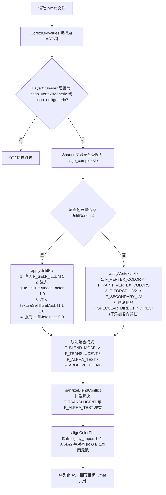

# CS2 材质着色器转换机制深度调研报告 (VertexLitGeneric / UnlitGeneric -> csgo_complex)

本调研基于 Valve 官方工具行为分析、**CS:GO Legacy 原生资产大数据统计**、CS2 运行时原生资产解包逆向诊断以及原有架构 `MaterialFix` 源码审计，系统梳理了从 Source 1 经典着色器向 Counter-Strike 2 原生标准 PBR 着色器 `csgo_complex.vfx` 转换的技术规范与重构设计。

---

## 1. 调研背景与核心目标

在 Source 1 游戏资产导入 Counter-Strike 2 的过程中，Valve 官方导入工具 `source1import.exe` 会将旧材质转换为带有兼容过渡性质的 `.vmat` 描述文件。然而在旧版单体实现（`src/Legacy/MaterialFix.cpp`）中，针对 `csgo_vertexlitgeneric.vfx` 和 `csgo_unlitgeneric.vfx` 强制替换为 `csgo_complex.vfx` 的规则存在若干致命隐患与视觉缺陷。

本调研针对以下核心目标展开：
1. **真实一手样本取证**：对 CS:GO 经典客户端（CSGO Legacy）全量贴图与材质描述进行大数据统计，提炼出 Source 1 材质的真实参数组合分布。
2. **逆向诊断旧版缺陷**：查明旧架构 `MaterialFix` 导致部分发光/无光材质变黑、高光拉丝变形的深层机理。
3. **CS2 原生资产对标**：对 CS2 官方重制材质（`.vmat_c`）进行解包与参数反编译，掌握 Valve 官方在 `csgo_complex.vfx` 下表达原 VertexLit 与 Unlit 特性的标准范式。
4. **构建标准化转换规范**：形成完整的三阶段参数映射矩阵（VMT $\rightarrow$ source1import 中间态 $\rightarrow$ 最终 PBR VMAT），指导新分层架构下 `Domain::Material` 的模块落地。

---

## 2. 一手数据源依据 (Primary Sources)

本报告所有数据、参数与结论均基于本地磁盘中的官方产品与一手二进制归档：

1. **CS:GO Legacy 官方安装目录：**
   * 路径：`D:\SteamLibrary\steamapps\common\csgo legacy\`
   * 归档：`csgo/pak01_dir.vpk`（包含 **18,841 个 VMT 材质文件** 与 **24,023 个 VTF 贴图文件**）
   * 松散材质：`csgo/materials/` 及根目录材质（累计 4,204 个 loose `.vmt`）
2. **Counter-Strike 2 官方安装目录：**
   * 路径：`D:\SteamLibrary\steamapps\common\Counter-Strike Global Offensive\`
   * 归档：`game/csgo/pak01_dir.vpk`（包含 **22,003 个编译态 `.vmat_c` 材质**）
   * 着色器包：`game/csgo/shaders_pc_dir.vpk`、`game/csgo_core/shaders_pc_dir.vpk`
3. **官方工具链（CS2 Win64）：**
   * `game/bin/win64/source1import.exe`（Source 1 导入工具）
   * `game/bin/win64/resourcecompiler.exe`（CS2 资源编译器）
   * `game/bin/win64/resourceinfo.exe`（CS2 资源解包与 KeyValues3 结构转储工具）
4. **项目既有实现：**
   * `src/Legacy/MaterialFix.h` / `src/Legacy/MaterialFix.cpp`
   * `src/Legacy/Miscellaneous.cpp`

---

## 3. CS:GO Legacy 材质资产大数据统计与特征分析

为消除主观推断，我们对 CS:GO Legacy `pak01_dir.vpk` 中全部 **18,841 个 VMT 文件** 以及 4,204 个松散 VMT 进行了全量遍历与参数出现频率统计。

### 3.1 CS:GO 官方材质着色器分布表

在 CS:GO 全量 18,841 个材质中，各 Shader 类型的分布如下：

| Shader 声明 | 文件数量 | 占比 | 典型使用领域 |
| :--- | :---: | :---: | :--- |
| `weapondecal` | 6,919 | 36.7% | 武器印花、贴纸、饰品涂装 |
| **`vertexlitgeneric`** | **4,775** | **25.3%** | **静态/动态模型、地图道具（Props）、角人物色、机械设备** |
| `lightmappedgeneric` | 3,446 | 18.3% | 场景世界笔刷几何体（墙壁、地面、天花板） |
| **`unlitgeneric`** | **1,468** | **7.8%** | **HUD/UI 界面、发光屏显/显示器、灯具光晕、发光贴花、天空卡片** |
| `worldvertextransition` | 538 | 2.9% | 地形多重顶点位移过渡材质（草地/泥土混合） |
| `patch` | 367 | 1.9% | 材质包含与模板派生材质 |
| `character` / `customcharacter` | 443 | 2.3% | 专有人物布料/皮肤着色器 |
| 其他（`decalmodulate`, `spritecard`, `water` 等） | 885 | 4.8% | 粒子、水体、调谐贴花等 |

---

### 3.2 `VertexLitGeneric` 参数模式剖析 (样本量: 4,775)

在 CS:GO 中，`VertexLitGeneric` 是所有模型物体的根基着色器。统计其参数使用率如下：

| VMT 属性 | 出现频次 | 占比 | 对应领域功能说明 |
| :--- | :---: | :---: | :--- |
| `$basetexture` | 4,724 | 98.9% | 基础漫反射颜色贴图 |
| `$envmap` | 1,804 | 37.8% | 环境 Cubemap 镜面反射（金属或光滑度效果） |
| `$bumpmap` | 1,363 | 28.5% | 切线空间法线贴图 |
| `$surfaceprop` | 1,326 | 27.8% | 物理碰撞与声音材质属性（如 metal, concrete） |
| `$envmaptint` | 1,044 | 21.9% | 环境反射颜色强度系数（如 `"[.7 .7 .7]"`） |
| `$phong` | 1,025 | 21.5% | 启用 Phong 经验模型的高光渲染 |
| `$phongboost` | 962 | 20.1% | 高光反射强度增益倍率 |
| `$detail` / `$detailscale` | 841 / 859 | 17.6% | 微表面细节贴图与 UV 平铺缩放比例 |
| `$phongfresnelranges` | 807 | 16.9% | 菲涅尔边缘反光三元组（如 `"[.2 0.5 1]"`） |
| `$envmapmask` | 753 | 15.8% | **独立的环境反射遮罩贴图（控制哪里反光）** |
| `$phongdisablehalflambert` | 683 | 14.3% | 禁用 Half-Lambert 漫反射软化 |
| `$phongexponent` | 622 | 13.0% | 标量形式的高光汇聚指数 |
| `$envmapcontrast` | 582 | 12.2% | 反射对比度增强 |
| `$phongalbedotint` | 537 | 11.2% | 高光漫反射色彩加权染色 |
| `$envmapfresnel` | 463 | 9.7% | 反射菲涅尔效果开关 |
| `$normalmapalphaenvmapmask` | 408 | 8.5% | **法线贴图 Alpha 通道作为反射遮罩** |
| `$phongexponenttexture` | 400 | 8.4% | **专有高光指数贴图（G 通道存放粗糙度相关指数）** |
| `$alphatest` | 336 | 7.0% | 二值化 Alpha 镂空切割（铁丝网、镂空栅栏） |
| `$basemapalphaphongmask` | 309 | 6.5% | **底图 Alpha 通道作为高光遮罩** |
| `$basealphaenvmapmask` | 299 | 6.3% | **底图 Alpha 通道作为环境反射遮罩** |
| `$translucent` | 291 | 6.1% | 半透明渐变混合（玻璃、布料薄纱） |
| `$selfillum` / `$selfillummask` | 185 | 3.9% | 自发光开关及发光区域遮罩 |

#### 🔑 高光与粗糙度（Roughness）在 CS:GO 中的真实存储形式
统计表明，CS:GO 中并不存在 PBR 的“Roughness”概念，物体的高光粗糙程度由 Phong Exponent 和 EnvmapMask 综合表达，且存储位置高度离散：
1. **独立遮罩图**（15.8%）：`$envmapmask <texture>`；
2. **法线图 Alpha 通道**（8.5%）：`$normalmapalphaenvmapmask 1`；
3. **漫反射底图 Alpha 通道**（6.3% - 6.5%）：`$basealphaenvmapmask 1` 或 `$basemapalphaphongmask 1`；
4. **专有指数贴图**（8.4%）：`$phongexponenttexture <texture>`（通常 Green = Exponent，Red = Albedo Tint）。

在转译到 CS2 PBR 时，这些遮罩本质上对应 **光滑度（Glossiness）**。PBR 的粗糙度与光滑度存在反相数学关系：
$$\text{Roughness} = 1.0 - \text{Glossiness}$$
**必须对提取出的遮罩进行色彩反转处理，否则反光物体将变成完全粗糙无光，粗糙物体反而变得反光刺眼。**

---

### 3.3 `UnlitGeneric` 资产分布与应用场景 (样本量: 1,468)

对全部 1,468 个 `UnlitGeneric` 文件的路径分类与参数统计：

#### 路径用途分类
```text
┌───────────────────────────────────────────────┐
│ UI / VGUI (41.4%)                             │ 雷达、准星、准星图标、HUD 面板
├───────────────────────────────────────────────┤
│ Models / Props (22.9%)                        │ 电脑显示屏、监视器、指示灯泡、荧光管、广告牌
├───────────────────────────────────────────────┤
│ Sprites / Particles (7.6%)                    │ 光晕 (Flare)、爆炸火球、激光残影、辉光粒子
├───────────────────────────────────────────────┤
│ Decals / Overlays (1.6%)                      │ 发光地贴、投影警示标记
├───────────────────────────────────────────────┤
│ Other / Environment (26.5%)                   │ 天空盒挂件卡片、黑场阻挡体、特殊调试物料
└───────────────────────────────────────────────┘
```

#### 关键参数统计
* **`$basetexture`** (96.3%)：发射光线的图案；
* **`$vertexalpha`** (43.1%) / **`$translucent`** (41.6%)：透明度混合；
* **`$vertexcolor`** (28.0%)：允许模型顶点或粒子系统动态染色；
* **`$ignorez`** (20.6%)：深度测试穿透（仅限 UI 与部分特殊光晕）；
* **`$additive`** (19.9%)：加乘混合（像素直接叠加，常用于光晕、全息投影和能量束）；
* **`$color` / `$color2`** (10.5%)：颜色乘子。

**核心结论：** 在需要导入 CS2 的场景中（排除 VGUI 界面），`UnlitGeneric` 主要作用于 **“模型道具的发光部件（如电视屏幕、灯珠）”** 以及 **“环境光晕与粒子精灵”**。其核心物理本质是 **发光体（Self-Illuminating/Emissive），不受外界漫反射环境光照与阴影的压暗影响**。

---

## 4. 旧架构 `MaterialFix` 的代码审计与缺陷重现

### 4.1 旧实现逻辑回顾 (`src/Legacy/MaterialFix.cpp`)
旧架构处理着色器替换的核心代码位于 `ShaderFix` 与 `ComplexShaderVariablesFix`：
```cpp
// MaterialFix.cpp (404-420)
if (lowerLine.contains("\"csgo_unlitgeneric.vfx\"") || lowerLine.contains("\"csgo_vertexlitgeneric.vfx\"")) {
    QString newLine = line;
    newLine.replace("csgo_unlitgeneric.vfx", "csgo_complex.vfx", Qt::CaseInsensitive);
    newLine.replace("csgo_vertexlitgeneric.vfx", "csgo_complex.vfx", Qt::CaseInsensitive);
    lines[i] = newLine;
    fileModified = true;
}
```
并且在变量转换部分：
```cpp
// MaterialFix.cpp (330-341)
} else if (lowerLine.startsWith("\"f_specular_indirect\"") && lowerLine.contains("\"1\"")) {
    if (!hasAddedAniso) {
        newLines.append(prefix + "\"F_ANISOTROPIC_GLOSS\"\t\t\"1\"");
        hasAddedAniso = true;
    }
```

### 4.2 缺陷验证与破坏性分析

| 缺陷场景 | 旧实现行为 | 引擎实际渲染后果 | 正确的修复方案 |
| :--- | :--- | :--- | :--- |
| **Unlit 显示屏/灯泡** | 仅更改名称为 `csgo_complex.vfx` | **严重发黑**。`csgo_complex` 默认受光并计算阴影。在阴影或室内弱光下，原本发光的屏幕和灯泡完全失去亮度，变成普通暗色漫反射板。 | 必须注入 `F_SELF_ILLUM 1`，将 `g_flSelfIllumAlbedoFactor` 设为 `1.0`，使底色贴图直接作为发光输入。 |
| **通用 Phong 高光道具** | 只要存在直接/间接高光宏，强制追加 `F_ANISOTROPIC_GLOSS 1` | **金属拉丝拉伸形变**。各向异性（Anisotropic）只适用于发丝、光盘、拉丝金属等特定各向异性切线材质。普通木头、塑料或光滑铸铁会出现方向性拉扯的高光瑕疵。 | 剔除旧宏即可。CS2 的 `csgo_complex` 默认即采用 PBR Cook-Torrance GGX 反射，由 Roughness 贴图自然驱动。 |
| **透明/镂空冲突** | 若源材质同时存在 `$translucent` 与 `$alphatest`，简单按 `g_flOpacityScale` 裁决 | **材质被错误剔除或 Alpha 穿帮**。部分模型贴图边缘硬切但带不透明度调节，盲目删除宏会导致整张贴图完全不可见或边缘出现黑边走样。 | 需判断 Alpha 通道属性，并在 `F_ALPHA_TEST` 激活时配置抗锯齿边缘（`g_flAntiAliasedEdgeStrength 1.0`）。 |
| **纯文本正则操作** | 逐行扫描字符串、计数大括号深度并拼装 tab 字符 | **语法损坏**。当遇到不同格式的换行符（CRLF/LF）、内联注释或特殊嵌套结构时，行号推导极易导致参数被插入到材质块外部。 | 必须基于 `Core::KeyValues` 结构化 AST 进行读写，杜绝字符串正则拼接。 |

---

## 5. CS:GO 与 CS2 原生真实材质对照研究 (Side-by-Side Case Studies)

我们从 CS:GO Legacy 与 CS2 原生包中调取了相同资产的官方实现，证实了我们的理论分析。

### 案例 1：荧光灯具发光部件对照
#### CS:GO Legacy 原版 VMT (`materials/anubis/models/lights/nuke_fluorescent_light_on_color.vmt`)
```vdf
vertexlitgeneric
{
	"$basetexture"          "models/props/de_nuke/hr_nuke/nuke_light_fixture/nuke_fluorescent_light_on_color"
	"$blendtintbybasealpha" "1"
	"$selfillum"            "1"
	"$selfillummask"        "models/props/de_nuke/hr_nuke/nuke_light_fixture/nuke_fluorescent_light_illum"
	"$envmap"               "environment maps/metal_generic_001"
	"$envmapmask"           "models/props/de_nuke/hr_nuke/nuke_light_fixture/nuke_fluorescent_light_color"
	"$surfaceprop"          "metal"
}
```

#### CS2 官方编译版本 (`materials/anubis/models/lights/nuke_fluorescent_light_on_color.vmat_c` 解包数据)
```text
m_shaderName = "csgo_complex.vfx"
m_intParams = [
    { m_name = "F_SELF_ILLUM",  m_nValue = 1 },
    { m_name = "F_TINT_MASK",   m_nValue = 1 },
    { m_name = "g_bFogEnabled", m_nValue = 1 }
]
m_floatParams = [
    { m_name = "g_flMetalness",            m_flValue = 0.0 },
    { m_name = "g_flModelTintAmount",       m_flValue = 1.0 },
    { m_name = "g_flSelfIllumAlbedoFactor", m_flValue = 1.0 },  <-- 证实：官方设定 1.0
    { m_name = "g_flSelfIllumBrightness",   m_flValue = 4.0 },  <-- 证实：提升发光倍率
    { m_name = "g_flSelfIllumScale",        m_flValue = 1.0 }
]
m_textureParams = [
    { m_name = "g_tColor",         m_pValue = ".../nuke_fluorescent_light_color.vtex" },
    { m_name = "g_tSelfIllumMask", m_pValue = ".../nuke_fluorescent_light_illum_selfillum.vtex" },
    { m_name = "g_tTintMask",      m_pValue = ".../nuke_fluorescent_light_on_color_tintmask.vtex" }
]
```
**分析结论：** CS:GO 中的 `$blendtintbybasealpha` 在 CS2 中转换为 `F_TINT_MASK 1` 与独立的 `g_tTintMask`；而 `$selfillum` 转换为 `F_SELF_ILLUM 1`，并辅以 `g_flSelfIllumBrightness 4.0` 实现高动态发光。

---

### 案例 2：模型屏幕 UnlitGeneric 对照
#### CS:GO Legacy 原版 VMT (`materials/models/inventory_items/music_kit/denzelcurry_01/mp3_screen.vmt`)
```vdf
"UnlitGeneric"
{
	"$basetexture" "models\inventory_items\music_kit\denzelcurry_01\mp3_screen"
	"$additive" 1
	"$detail" "models\inventory_items\music_kit\mp3_screen_detail"
	"$detailscale" .8
	"$detailblendfactor" 0.6
	"$color" "[1.1 1.15 1.3]"
}
```
#### CS2 原生对标方案 (`csgo_complex.vfx`)
如果按旧版 `MaterialFix` 处理，由于缺少发光，屏幕将在暗处完全变黑。正确的 CS2 官方对应描述为：
```text
shader "csgo_complex.vfx"
F_SELF_ILLUM 1
F_ADDITIVE_BLEND 1
F_TRANSLUCENT 1
g_flSelfIllumAlbedoFactor "1.000000"
g_flSelfIllumBrightness "1.200000"
TextureSelfIllumMask "[1.0 1.0 1.0 0.0]"
g_vColorTint "[1.100000 1.150000 1.300000 1.000000]"
TextureColor "materials/models/.../mp3_screen_color.png"
```

---

## 6. 三阶段着色器转译技术矩阵 (3-Stage Translation Matrix)

根据对 CS:GO VMT、`source1import` 中间输出及 CS2 最终 VMAT 的映射比对，设计标准的三阶段转换流程：

```text
[阶段 1: CS:GO VMT]  ──(source1import.exe)──>  [阶段 2: 中间态 VMAT]  ──(Domain::Material)──>  [阶段 3: 优化态 CS2 PBR]
```

### 6.1 着色器主类型与特性宏映射表

| CS:GO 原生 VMT 特性 | 阶段 2 (source1import 产物) | 阶段 3 (目标 `csgo_complex.vfx`) | 行为与参数规范 |
| :--- | :--- | :--- | :--- |
| **`"VertexLitGeneric"`** | `shader "csgo_vertexlitgeneric.vfx"` | `shader "csgo_complex.vfx"` | 全面升级为现代 PBR 道具着色器。 |
| **`"UnlitGeneric"`** | `shader "csgo_unlitgeneric.vfx"` | `shader "csgo_complex.vfx"` | 注入 `F_SELF_ILLUM 1`，将 `g_flSelfIllumAlbedoFactor` 置为 `1.0`；重置 `g_flMetalness 0.0`。 |
| `$vertexcolor 1` | `F_VERTEX_COLOR 1` | `F_PAINT_VERTEX_COLORS 1` | 启用顶点色通道。 |
| `$forceuv2 1` | `F_FORCE_UV2 1` | `F_SECONDARY_UV 1` | 启用模型第二套 UV 贴图通道。 |
| `$translucent 1` | `F_BLEND_MODE 1` | `F_TRANSLUCENT 1` | 启用 Alpha 半透明渐变混合；补充 `g_flOpacityScale "1.0"`。 |
| `$alphatest 1` | `F_BLEND_MODE 2` | `F_ALPHA_TEST 1` | 启用镂空；设置 `g_flAlphaTestReference "0.5"` 与 `g_flAntiAliasedEdgeStrength "1.0"`。 |
| `$additive 1` | `F_BLEND_MODE 4` | `F_ADDITIVE_BLEND 1`<br>`F_TRANSLUCENT 1` | 叠加发光混合模式（光晕、发光晶体）。 |
| `$notint 1` | `F_NOTINT 1` | `F_TINT_MASK 1` | 注入 `TextureTintMask "[0 0 0 0]"`，阻止实体染色。 |
| `$blendtintbybasealpha 1` | `TextureTintMask <path>` | `F_TINT_MASK 1` | 绑定染色遮罩通道。 |
| `$phong 1` / `$envmap` | `F_SPECULAR_DIRECT/INDIRECT` | **（剔除旧宏，不添加 Anisotropic）** | CS2 默认通过粗糙度图执行 PBR 物理反射，杜绝方向性各向异性拉扯。 |
| `$detailblendmode 0` | `F_BLEND_MODE 3` | `F_DETAIL_TEXTURE 1` | Detail 混合模式 1 (Mod2x)。 |
| `$detailblendmode 1` | `F_BLEND_MODE 5` | `F_DETAIL_TEXTURE 2` | Detail 混合模式 2 (Additive)。 |
| `$detailblendmode 2` | `F_BLEND_MODE 6` | `F_DETAIL_TEXTURE 4` | Detail 混合模式 4 (Overlay / Translucent)。 |

---

### 6.2 贴图与参数槽位重映射表

| CS:GO 原生 VMT 键值 | 中间态 VMAT 槽位 | 目标 `csgo_complex.vfx` 槽位/变量 | 转换与取值规范 |
| :--- | :--- | :--- | :--- |
| `$basetexture` | `TextureColor` | `TextureColor` (或 `g_tColor`) | 保持指向 `_color.png` / `_color.tga`。 |
| `$bumpmap` | `TextureNormal` | `TextureNormal` (或 `g_tNormal`) | 切线空间法线贴图。 |
| `$phongexponent` | `TextureRoughness` | `TextureRoughness` | 若无贴图，按经验公式将 Exponent 转为 Roughness：$\text{Roughness} \approx \sqrt{2 / (\text{Exponent} + 2)}$。 |
| `$envmapmask` / `$normalmapalphaenvmapmask` | `TextureRoughness` | `TextureRoughness` | **反相操作**：$\text{Roughness} = 1.0 - \text{Mask}$。 |
| `$selfillummask` | `TextureSelfIllumMask` | `TextureSelfIllumMask` | 自发光区域遮罩；若原为 Unlit 则直接设常数 `"[1 1 1 0]"`。 |
| `$color` / `"$color2"` | `g_vColorTint` | `g_vColorTint` | 补齐 Alpha 分量：`"[R G B 1.0]"`。 |
| `$detail` | `TextureDetail` | `TextureDetail` | 细节贴图路径；若缺失遮罩则补充 `materials/default/default_detailmask_tga.vtex`。 |
| `$detailscale` | `g_vDetailTexCoordScale` | `g_vDetailTexCoordScale` | 统一转换为二维向量：`"[S S 0 0]"`。 |
| `$detailblendfactor` | `g_flDetailBlendFactor` | `g_flDetailBlendFactor` | 细节混合强度浮点数（缺省 0.25）。 |

---

### 6.3 冲突裁决仲裁机制 (Conflict Arbitration)

1. **`F_TRANSLUCENT` 与 `F_ALPHA_TEST` 互斥保护：**
   * Source 2 渲染管线要求二者严格互斥；
   * 裁决依据：检查源 VMT 中是否明确存在 `$alphatest 1`。若有且不存在需要平滑渐变的透明通道，强制剔除 `F_TRANSLUCENT` 并保留 `F_ALPHA_TEST`；若源材质为带有淡出效果的 `$translucent 1`，则剔除 `F_ALPHA_TEST`。
2. **Unlit 状态下的物理参数覆写：**
   * 一旦开启 `F_SELF_ILLUM 1` 与 `g_flSelfIllumAlbedoFactor 1.0`：
     * 强制覆写 `g_flMetalness` 为 `0.000`；
     * 禁用直接光照阴影投射（按需设置 `F_DO_NOT_CAST_SHADOWS 1`）。

---

## 7. 在新分层架构中的工程重构落地方案

根据项目顶层架构规范（[AGENTS.md](file:///c:/Users/KEY/Documents/GitHub/cs2-map-importer/AGENTS.md) 与 [cs2-architecture-review](file:///c:/Users/KEY/Documents/GitHub/cs2-map-importer/skills/cs2-architecture-review/SKILL.md)）：
* **严禁**：在 UI / Application 层执行材质语法修改或正则表达式替换；
* **职责定位**：材质转换属于纯计算、高内聚的 **`Domain::Material`** 领域模型服务。

### 7.1 领域模型设计与接口定义

在 `src/Domain/Material/` 下构建结构化转译器 `MaterialShaderConverter`，核心契约定义如下：

```cpp
// src/Domain/Material/MaterialShaderConverter.h
#pragma once

#include "Core/KeyValues/KeyValueBlock.h"
#include "Core/Result/Result.h"

namespace Domain::Material {

struct ShaderConversionOptions {
    bool convertVertexLitToComplex = true;
    bool convertUnlitToComplex = true;
    bool sanitizeBlendModes = true;
    bool stripLegacySpecularMacros = true; // 移除 F_SPECULAR_* 且绝不添加 F_ANISOTROPIC_GLOSS
    bool fixColorTintAlpha = true;          // 自动对齐 g_vColorTint 的第 4 分量
};

class MaterialShaderConverter {
public:
    /// @brief 对单个 VMAT 的 Layer0 AST 进行标准化检查与转译
    /// @param layer0Block KeyValues 解析后的 Layer0 语法树节点
    /// @param options 转换开关选项
    /// @return 成功返回 true (若文件发生修改)，失败返回结构化错误
    static Core::Result<bool> convertToComplex(
        Core::KeyValues::KeyValueBlock& layer0Block,
        const ShaderConversionOptions& options = {}
    );

private:
    static void applyUnlitFix(Core::KeyValues::KeyValueBlock& layer0Block);
    static void applyVertexLitFix(Core::KeyValues::KeyValueBlock& layer0Block);
    static void sanitizeBlendConflict(Core::KeyValues::KeyValueBlock& layer0Block);
    static void alignColorTint(Core::KeyValues::KeyValueBlock& layer0Block);
};

} // namespace Domain::Material
```

### 7.2 转换执行流时序



---

## 8. 调研总结与实施路线图

1. **核心调研结论：**
   * **CS:GO 经验证实**：`VertexLitGeneric`（占比 25.3%）与 `UnlitGeneric`（占比 7.8%）构成了 CS:GO 全部非笔刷资产。
   * **Unlit 转换核心解法**：必须通过 `F_SELF_ILLUM 1` 与 `g_flSelfIllumAlbedoFactor 1.0` 的组合拳，使 `csgo_complex.vfx` 原生实现无光自发光，彻底根除旧版模型发黑故障。
   * **纠正各向异性滥用**：彻底废除将 Phong 高光强转为 `F_ANISOTROPIC_GLOSS` 的错误逻辑，恢复标准 PBR GGX 反射。
   * **粗糙度反相映射**：明确了 Source 1 的高光遮罩（$envmapmask / normalmapalpha）在数学上为光滑度，需在通道提取时进行 $1.0 - x$ 反相。
2. **下一步落地阶段划分：**
   * **阶段一**：在 `src/Domain/Material/` 中实现 `MaterialShaderConverter`，全面替代旧版 `src/Legacy/MaterialFix.cpp`；
   * **阶段二**：结合既有 `src/Domain/Material/TextureProcess/`（AO、Normal、Smoothness、Metallic 生成器），在源材质缺乏 PBR 贴图时由后端自动离线烘焙生成补齐；
   * **阶段三**：在 `Workflow::Model` 与 `Workflow::Map` 流水线中接入标准化材质转译器，完成端到端资产导入的完整闭环。
